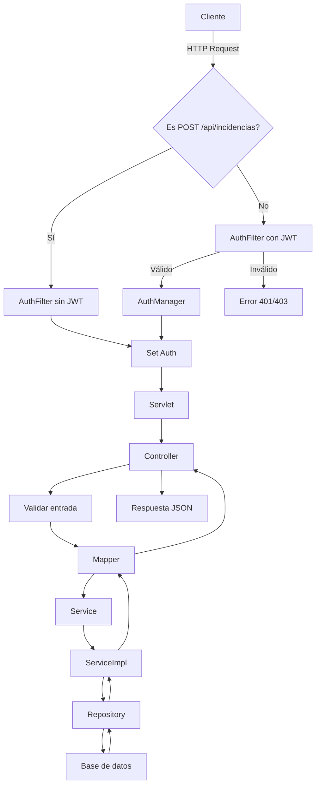

# Proyecto CeliaHelp

## Descripción
CeliaHelp es un sistema de gestión de incidencias que permite a usuarios:
- Crear, consultar, actualizar y eliminar incidencias.
- Registrar acciones en un log para trazabilidad.
- Gestionar usuarios y roles.

## Tecnologías
- **Backend**: Java 21, Spring Boot 3.4.4, Maven.
- **Persistencia**: MySQL 8.0, Spring Data JPA, Hibernate 6.6.
- **Contenedores**: Docker Compose (MySQL, phpMyAdmin, Backend, Frontend).
- **Control de versiones**: Git.

## Estructura del Proyecto
```
src/
 ├─ main/
 │   ├─ java/com/celiahelp/
 │   │   ├─ controller/   # Controladores REST
 │   │   ├─ dto/          # Data Transfer Objects
 │   │   ├─ exception/    # Excepciones y manejador global
 │   │   ├─ mapper/       # Mapeadores Entity<->DTO
 │   │   ├─ model/        # Entidades JPA
 │   │   ├─ repository/   # Repositorios Spring Data JPA
 │   │   └─ service/      # Interfaces de servicios
 │   │       └─ impl/  # Implementaciones de servicios
 │   └─ resources/
 │       └─ application.properties  # Configuración Spring
 │ 
 ├─ backend/Dockerfile
 │   └─ scripts/wait-for-it.sh
 └─ frontend/Dockerfile
 
```

## Uso con Docker Compose

1. Compilar el proyecto:
   ```bash
   ./mvn clean package
   ```
2. Levantar servicios:
   ```bash
   docker compose up --build
   ```
3. API disponible en `http://localhost:8080/api/`.

## Endpoints Principales

| Recurso         | Método | URI                           |
|-----------------|--------|-------------------------------|
| Incidencias     | GET    | `/api/incidencias`            |
|                 | GET    | `/api/incidencias/{id}`       |
|                 | POST   | `/api/incidencias`            |
|                 | PUT    | `/api/incidencias/{id}`       |
|                 | DELETE | `/api/incidencias/{id}`       |
| Usuarios        | GET    | `/api/usuarios`               |
|                 | POST   | `/api/usuarios`               |
|                 | PUT    | `/api/usuarios/{id}`          |
| Roles           | GET    | `/api/roles`                  |
|                 | POST   | `/api/roles`                  |
| Logs            | GET    | `/api/logs`                   |
|                 | POST   | `/api/logs`                   |

## Diagrama de flujo de usuario


## Frontend
UX y UI sencilla para poder consumir la API de forma rápida con funcionalidades básicas.

   - *Landing page* que te dirige a **Crear incidencia** o a **Login**.
![/img/]

   - 