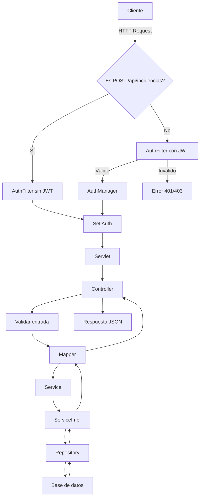

# Proyecto CeliaHelp

## Descripción
CeliaHelp es un sistema de gestión de incidencias que permite a usuarios:
- Crear, consultar, actualizar y eliminar incidencias.
- Registrar acciones en un log para trazabilidad.
- Gestionar usuarios y roles.

## Tecnologías
- **Backend**: Java 21, Spring Boot 3.4.4, Maven.
- **Persistencia**: MySQL 8.0, Spring Data JPA, Hibernate 6.6.
- **Contenedores**: Docker Compose (MySQL, phpMyAdmin, Backend, Frontend).
- **Control de versiones**: Git.

## Estructura del Proyecto
```
src/
 ├─ main/
 │   ├─ java/com/celiahelp/
 │   │   ├─ controller/   # Controladores REST
 │   │   ├─ dto/          # Data Transfer Objects
 │   │   ├─ exception/    # Excepciones y manejador global
 │   │   ├─ mapper/       # Mapeadores Entity<->DTO
 │   │   ├─ model/        # Entidades JPA
 │   │   ├─ repository/   # Repositorios Spring Data JPA
 │   │   └─ service/      # Interfaces de servicios
 │   │       └─ impl/  # Implementaciones de servicios
 │   └─ resources/
 │       └─ application.properties  # Configuración Spring
 │ 
 ├─ backend/Dockerfile
 │   └─ scripts/wait-for-it.sh
 └─ frontend/Dockerfile
```

## Uso con Docker Compose

1. Compilar el proyecto:
   ```bash
   ./mvn clean package
   ```
2. Levantar servicios:
   ```bash
   docker compose up --build
   ```
3. Documentación de la API disponible en `http://localhost:8080/swagger-ui/index.html`.

## Endpoints Principales

| Recurso         | Método | URI                           |
|-----------------|--------|-------------------------------|
| Incidencias     | GET    | `/api/incidencias`            |
|                 | GET    | `/api/incidencias/{id}`       |
|                 | POST   | `/api/incidencias`            |
|                 | PUT    | `/api/incidencias/{id}`       |
|                 | DELETE | `/api/incidencias/{id}`       |
| Usuarios        | GET    | `/api/usuarios`               |
|                 | POST   | `/api/usuarios`               |
|                 | PUT    | `/api/usuarios/{id}`          |
| Roles           | GET    | `/api/roles`                  |
|                 | POST   | `/api/roles`                  |
| Logs            | GET    | `/api/logs`                   |
|                 | POST   | `/api/logs`                   |

## Diagrama de flujo de usuario

## Flujo de securización con JWT
```mermaid
flowchart TD
    A[Petición HTTP entrante] --> B{"¿Ruta pública?"}
    B -- Sí --> Z[Permitir acceso sin token]
    B -- No --> C[JwtAuthenticationFilter]
    C --> D{"¿Authorization: Bearer <token>?"}
    D -- No --> J["JwtAuthenticationEntryPoint → 401"]
    D -- Sí --> E[Validar token con JwtTokenProvider]
    E --> F{"¿Token válido?"}
    F -- No --> J
    F -- Sí --> G[Extraer usuario y roles]
    G --> H[UserDetailsServiceImpl carga el usuario]
    H --> I[Setear Authentication en SecurityContext]
    I --> K[Permitir acceso a recursos protegidos]

    classDef green fill:#bbf,stroke:#333,stroke-width:1px;
   ```

## 📘 Guía de Creación y Funcionamiento del Frontend - CeliaHelp

### 1. Estructura General del Proyecto

**Ubicación**: `/frontend`

| Archivo | Propósito |
|--------|-----------|
| `index.html` | Página de bienvenida con acceso general. |
| `create.html` | Formulario público para registrar incidencias sin autenticación. |
| `login.html` | Formulario de login, captura credenciales y obtiene JWT. |
| `incidencias.html` | Panel privado para visualizar y filtrar incidencias. |
| `api.js` | Módulo de funciones `fetch` para interactuar con la API. |
| `style.css` | Estilos personalizados con identidad visual (*tema CeliaHelp*). |


### 2. Funcionamiento General

**Flujo de navegación**:
```
index.html → [crear.html] o [login.html] → incidencias.html (si login correcto)
```

📸 *Imagen sugerida*: Diagrama de flujo de navegación entre páginas.

### 3. Comunicación con el Backend

- Se utiliza `fetch` para todas las peticiones HTTP.
- El `token JWT` se guarda en `localStorage` tras el login.
- Cada petición autenticada incluye `Authorization: Bearer <token>`.

#### Ejemplo: login (dentro de `api.js`)
```javascript
async function loginUser(credentials) {
  const response = await fetch('/auth/login', {
    method: 'POST',
    headers: { 'Content-Type': 'application/json' },
    body: JSON.stringify(credentials)
  });
  const data = await response.json();
  if (data.token) {
    localStorage.setItem('token', data.token);
  }
  return data;
}
```
Salida de comando exitosos
```shell
celia-api     | 2025-05-23T12:44:03.471Z DEBUG 1 --- [celiahelp] [nio-8080-exec-1] o.s.security.web.FilterChainProxy        : Securing OPTIONS /auth/login
celia-api     | 2025-05-23T12:44:03.488Z DEBUG 1 --- [celiahelp] [nio-8080-exec-4] o.s.security.web.FilterChainProxy        : Securing POST /auth/login
celia-api     | 2025-05-23T12:44:03.488Z DEBUG 1 --- [celiahelp] [nio-8080-exec-4] o.s.s.w.a.AnonymousAuthenticationFilter  : Set SecurityContextHolder to anonymous SecurityContext
celia-api     | 2025-05-23T12:44:03.488Z DEBUG 1 --- [celiahelp] [nio-8080-exec-4] o.s.security.web.FilterChainProxy        : Secured POST /auth/login
celia-api     | 2025-05-23T12:44:03.488Z DEBUG 1 --- [celiahelp] [nio-8080-exec-4] o.s.web.servlet.DispatcherServlet        : POST "/auth/login", parameters={}
celia-api     | 2025-05-23T12:44:03.489Z DEBUG 1 --- [celiahelp] [nio-8080-exec-4] s.w.s.m.m.a.RequestMappingHandlerMapping : Mapped to com.celiahelp.controller.AuthController#login(LoginRequest)
celia-api     | 2025-05-23T12:44:03.489Z DEBUG 1 --- [celiahelp] [nio-8080-exec-4] m.m.a.RequestResponseBodyMethodProcessor : Read "application/json;charset=UTF-8" to [LoginRequest[email=admin@celiahelp.com, password=admin123]]
celia-api     | 2025-05-23T12:44:03.491Z DEBUG 1 --- [celiahelp] [nio-8080-exec-4] org.hibernate.SQL                        : 
celia-api     |     select
celia-api     |         u1_0.id,
celia-api     |         u1_0.email,
celia-api     |         u1_0.nombre,
celia-api     |         u1_0.password_hash,
celia-api     |         r1_0.id,
celia-api     |         r1_0.tipo 
celia-api     |     from
celia-api     |         usuarios u1_0 
celia-api     |     join
celia-api     |         roles r1_0 
celia-api     |             on r1_0.id=u1_0.rol_id 
celia-api     |     where
celia-api     |         u1_0.email=?
celia-api     | Hibernate: 
celia-api     |     select
celia-api     |         u1_0.id,
celia-api     |         u1_0.email,
celia-api     |         u1_0.nombre,
celia-api     |         u1_0.password_hash,
celia-api     |         r1_0.id,
celia-api     |         r1_0.tipo 
celia-api     |     from
celia-api     |         usuarios u1_0 
celia-api     |     join
celia-api     |         roles r1_0 
celia-api     |             on r1_0.id=u1_0.rol_id 
celia-api     |     where
celia-api     |         u1_0.email=?
celia-api     | 2025-05-23T12:44:03.552Z DEBUG 1 --- [celiahelp] [nio-8080-exec-4] o.s.s.a.dao.DaoAuthenticationProvider    : Authenticated user
celia-api     | 2025-05-23T12:44:03.553Z DEBUG 1 --- [celiahelp] [nio-8080-exec-4] o.s.w.s.m.m.a.HttpEntityMethodProcessor  : Using 'application/json', given [*/*] and supported [application/json, application/*+json, application/yaml]
celia-api     | 2025-05-23T12:44:03.554Z DEBUG 1 --- [celiahelp] [nio-8080-exec-4] o.s.w.s.m.m.a.HttpEntityMethodProcessor  : Writing [AuthResponse[accessToken=eyJhbGciOiJIUzI1NiJ9.eyJzdWIiOiJhZG1pbkBjZWxpYWhlbHAuY29tIiwiaWF0IjoxNzQ4MD (truncated)...]
celia-api     | 2025-05-23T12:44:03.554Z DEBUG 1 --- [celiahelp] [nio-8080-exec-4] o.s.web.servlet.DispatcherServlet        : Completed 200 OK
celia-front   | 172.18.0.1 - - [23/May/2025:12:44:03 +0000] "GET /incidencias.html HTTP/1.1" 200 2070
celia-front   | 172.18.0.1 - - [23/May/2025:12:44:03 +0000] "GET /js/view.js HTTP/1.1" 200 1839
celia-api     | 2025-05-23T12:44:03.600Z DEBUG 1 --- [celiahelp] [nio-8080-exec-3] o.s.security.web.FilterChainProxy        : Securing OPTIONS /api/incidencias
celia-api     | 2025-05-23T12:44:03.605Z DEBUG 1 --- [celiahelp] [nio-8080-exec-7] o.s.security.web.FilterChainProxy        : Securing GET /api/incidencias
```

### 4. Seguridad y Protección de Rutas

- Las páginas públicas no requieren token (`index.html`, `create.html`, `login.html`).
- `incidencias.html` verifica si hay token válido antes de cargar.
- Si no hay token → redirige a `login.html`.

#### Ejemplo:
```javascript
const token = localStorage.getItem('token');
if (!token) {
  window.location.href = 'login.html';
}
```

📸 *Imagen sugerida*: Intento de acceso directo a `incidencias.html` sin login → redirige.


### 5. Interacción con la API REST

#### GET incidencias (privado):
```javascript
fetch('/api/incidencias', {
  headers: { 'Authorization': 'Bearer ' + localStorage.getItem('token') }
});
```

#### POST nueva incidencia (pública):
```javascript
fetch('/api/incidencias', {
  method: 'POST',
  headers: { 'Content-Type': 'application/json' },
  body: JSON.stringify({ titulo, descripcion, ... })
});
```
  


  


### 6. Mejora y Mantenimiento

- **Modularización**: separar `api.js` en servicios por entidad.
- **Gestión de errores**: mostrar mensajes más amigables en frontend.
- **Validación de formularios**: incluir validaciones HTML y JS.

📸 *Imagen sugerida*: Ejemplo de mensaje de error o validación en el formulario.